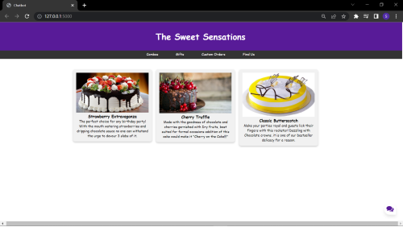

# ML-Web-Assistant🦸🏽‍♀️
The 2 main uses of Python in this project are:
1) For ML/AI Application
2) For Backend using modules like Django and Flask

This project was a step in combining both of these different domains into one perfect application. It is built using `Flask`, `NLTK` and `Tensorflow`. Since it is a web based app, we have used `Flask` at the backend and the Chatbot is developed using `NLTK` which is used to work with Human readable data and make it easier for the progran to understand and `Tensorflow` & `TfLearn` was used to train the model which is based on DNN i.e. Deep Neural Network 

Presenting T.I.N.A. the ChatBot!! 🙋🏽‍♀️

The Bot is named T.I.N.A. which stands for:
```
T - Tensorflow
I - Integrated
N - Neural network
A - Assistant
```

## The Website 🌐
The Frontend for the website is developed using HTML,CSS and JavaScript. And the backend is made using Python's Micro Web Development Framework Flask. It is portrayed as a Cake selling website that has a ChatBot employed as a 24/7 assistance for solving the doubts of the customers.
The backend has employed 2 different routes:

### 1) The Home route ("/"):
This route is the homepage of the website that displays the UI and is where the ChatBot is accessible.

### 2) The Predict route ("/predict"):
This route is used by the Website to send the user input to the ChatBot and get the appropriate reply from the ChatBot and deliver it to the Website.

## Training the Model 🧠⚙
It is trained upon the intents file which has various patterns of questions that can be asked by the user it also has the responses that are apt and problem solving and also has tags associated with it. The model is saved as model.tflearn which forms the brain of the ChatBot.

## The Bot has a few functions as follows
### bag_of_words() 🎒
Bag of words is a function that gets the sentence input of the user and makes a list of all the words in the sentence and then stems them if there a word(s_words) from the global words list(words) it increases the count of that word by 1.
```Python
def bag_of_words(s, words):
    bag = [0 for _ in range(len(words))]

    s_words = nltk.word_tokenize(s)
    s_words = [stemmer.stem(word.lower()) for word in s_words]

    for se in s_words:
        for i, w in enumerate(words):
            if w == se:
                bag[i] = 1
    return numpy.array(bag)
```

### Chat() 💭
This function is the real hero the one who takes in the question from the user as an input from the JSON and processes it using the function `bag_of_words()` gets the answer that has the highest percentage of being correct. If the percntage is below 70% the function returns that the entered input is inappropriate and returns a correct response if is above 70%.

```Python
def chat(input):
    while True:
        results = model.predict([bag_of_words(input, words)])[0]
        results_index = numpy.argmax(results)
        tag = labels[results_index]

        if results[results_index] > 0.7:
            for tg in data["intents"]:
                if tg['tag'] == tag:
                    responses = tg['responses']
            reply = random.choice(responses)
            if reply == "recommend":
                reply = Recommend()
                return reply
            elif reply == "best selling":
                reply = BestSelling()
                return reply
            else:
                return reply
        else:
            return "I didn't get that, try again."
```

### Recommend() 🧾
The Recommend function uses pandas to function. It takes the names and corresponding ratings of that cake and sorts them according to the heading `Rating` in ascending order. The `tail()` function gets the last 5 of the list and then converts individual names into a sentence that can be sent back to the user saying these are our bestselling cakes.
```Python
def Recommend():
    df = pd.read_excel('Cake_List.xlsx')
    final_data = df.sort_values('Ratings')
    new_data = final_data.tail()
    best_names = new_data['Name'].to_list()
    str_ = ""
    count = 0
    for n in best_names:
        if count == len(best_names)-1:
            str_ = str_ + n + "."
        else:
            str_ = str_ + n + ", "
            count +=1
    return "Our bestselling cakes are as follows: " + str_
```

### Bestselling() ✨
This function does the same exact function as the recommend function the only difference is that instead of getting the last 5 entries it just gets a single entry from the dataset and displays saying according to our customers this is our bestselling cake.
```Python
def BestSelling():
    df = pd.read_excel('Cake_List.xlsx')
    all_names = df['Name'].to_list()
    all_ratings = df['Ratings'].to_list()
    return "According to our customers " + str(all_names[all_ratings.index(max(all_ratings))]) + " is our best selling cake "
```

## Some snaps of the project 📸
<p align=center>
  
  <p align=center>Website in action</p>
</p>
<p align=center>
  <p align=center>The ChatBot can be accessed by clicking on the message icon in the bottom right corner</p>
</p>
<p align=center>
  
  <p align=center>Replying user</p>
</p>
