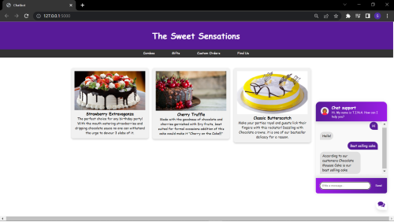

# 🤖ML-Web-Assistant🦸🏽‍♀️
The 2 main uses of Python are:
1) For ML/AI Application
2) For Backend using modules like Django and Flask

This project was a step in combining both of these different domains into one perfect application. It is built using `Flask`, `NLTK` and `Tensorflow`. Since it is a web based app, we have used `Flask` at the backend and the Chatbot is developed using `NLTK` which is used to work with Human readable data and make it easier for the progran to understand and `Tensorflow` & `TfLearn` was used to train the model which is based on DNN i.e. Deep Neural Network 

Presenting T.I.N.A. the ChatBot!!🙋🏽‍♀️

The Bot is named T.I.N.A. which stands for:
```
T - Tensorflow
I - Integrated
N - Neural network
A - Assistant
```
## Training the Model🧠⚙
It is trained upon the intents file which has various patterns of questions that can be asked by the user it also has the responses that are apt and problem solving and also has tags associated with it. The model is saved as model.tlearn which forms the brain of the ChatBot.

## The Website🌐:
The Frontend for the website is developed using HTML,CSS and JavaScript. It is a Cake selling website that has a ChatBot employed for letting the users know what they'd like to know about the cakes.

## Some snaps of the project📸:
<p align=center>
  
  <p align=center>Website in action</p>
</p>
<p align=center>
  <p align=center>The ChatBot can be accessed by clicking on the message icon in the bottom right corner</p>
</p>
<p align=center>
  
  <p align=center>Replying user</p>
</p>